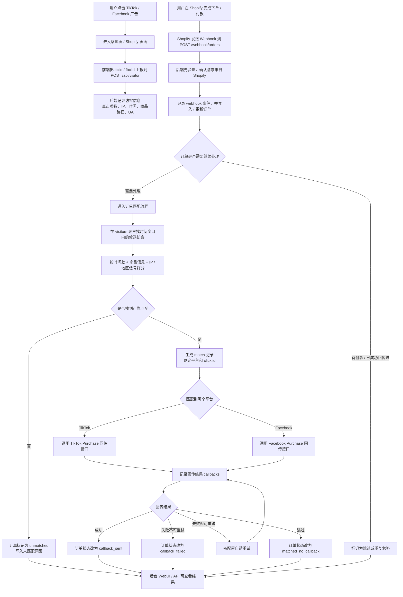

# 程序逻辑流程图

这份文档专门讲一件事：这个后端程序到底是怎么一步一步跑起来的。

如果你想快速理解，可以先看下面这张总流程图，再看后面的“大白话说明”。

## 一、总流程图

## 二、大白话版本

你可以把这个程序理解成一个“中间记账员”：

1. 它先记下“谁点了广告”
2. 再记下“谁下了单”
3. 然后努力判断“这两个是不是同一个人”
4. 如果像，就把“这笔订单来自广告”回传给 TikTok 或 Facebook
5. 最后把整个过程都记下来，方便你在后台看结果和排查问题

## 三、分阶段说明

### 1. 访客进入阶段

入口：

- `POST /api/visitor`

这一步做的事：

- 接收前端上报的 `ttclid` 或 `fbclid`
- 记录访客 IP
- 记录访问时间
- 记录访问商品路径
- 记录浏览器信息

写入的数据表：

- `visitors`

这一步的意义：

- 给后面的订单匹配准备“广告点击证据”

### 2. 订单进入阶段

入口：

- `POST /webhook/orders`

这一步做的事：

- 接收 Shopify 发来的订单 webhook
- 先校验签名，防止被别人伪造请求
- 记录 webhook 本身
- 把订单写入 `orders`
- 给这次处理链路生成一个统一的 `trace_id`

写入的数据表：

- `webhook_events`
- `orders`

这一步的意义：

- 把“订单来了”这件事正式记下来

### 3. 订单是否继续处理

程序不会对所有订单都直接做回传，它会先判断：

- 订单是不是 `pending`
- 这笔订单以前是不是已经成功回传过

如果符合这些情况，就直接跳过：

- `ignored_pending`
- `duplicate_ignored`

这一步的意义：

- 避免把不该回传的订单发出去
- 避免重复回传同一笔订单

### 4. 匹配阶段

这是这个程序最核心的一步。

程序会去 `visitors` 表里找：

- 在配置时间窗口内的访客
- 并且这些访客必须带有 `ttclid` 或 `fbclid`

然后对候选访客打分，主要看：

- 下单时间和点击时间差多近
- 访客看的商品和订单商品是否一致
- IP 或地区信息是否接近

如果分数太低，或者第一名和第二名太接近，程序就不会硬猜，而是标记为：

- `unmatched`

如果找到可靠匹配，就会：

- 生成一条 `matches` 记录
- 确定是 TikTok 还是 Facebook
- 取出对应的 click id

写入的数据表：

- `matches`

这一步的意义：

- 把“这笔订单最可能来自哪次广告点击”找出来

### 5. 回传阶段

匹配完成后，程序会根据平台分两条路：

- TikTok：发送 `Purchase` 事件
- Facebook：发送 `Purchase` 事件

程序会记录：

- 这次发给了哪个平台
- 触发来源是什么
- 这是第几次尝试
- HTTP 状态码
- 平台返回了什么
- 失败原因是什么

如果失败而且属于可重试错误，比如：

- 超时
- 429
- 5xx

程序会按配置自动再试几次。

写入的数据表：

- `callbacks`

这一步的意义：

- 真正把“订单转化”回传给广告平台

### 6. 订单结果落地阶段

回传完成后，订单会变成这些状态之一：

- `callback_sent`：回传成功
- `callback_failed`：回传失败
- `matched_no_callback`：匹配到了，但因为缺配置等原因没有真正发出去
- `unmatched`：没找到可靠匹配

同时程序会把原因写进：

- `status_reason`

这一步的意义：

- 让你以后打开后台时，能知道每笔订单卡在哪一步

### 7. 后台查看阶段

你在 WebUI 或 API 里看到的数据，基本都来自下面几张表：

- `visitors`：广告访客记录
- `orders`：订单处理结果
- `matches`：订单和点击的匹配结果
- `callbacks`：每次回传尝试结果
- `webhook_events`：Shopify 推送记录

你可以通过这些接口查看：

- `GET /api/stats`
- `GET /api/system`
- `GET /api/orders`
- `GET /api/matches`
- `GET /api/callbacks`
- `GET /api/webhook-events`
- `GET /api/visitors`

## 四、数据库在整个系统里的作用

可以把数据库理解成“总账本”。

它负责保存：

- 广告点击证据
- 订单原始数据
- 匹配结果
- 每次回传尝试
- 每次 webhook 处理记录

所以这个程序不是“纯实时、过了就没了”，而是：

- 每一步都会留痕
- 每一步都可以回头查

## 五、排查问题时该怎么想

如果你以后排查问题，可以按这个顺序看：

1. 有没有收到访客上报
   - 看 `visitors`
2. 有没有收到 Shopify 订单
   - 看 `webhook_events`
3. 订单有没有成功匹配
   - 看 `matches`
4. 有没有真正发回传
   - 看 `callbacks`
5. 订单最终状态是什么
   - 看 `orders.status` 和 `orders.status_reason`

如果要把一整条链路串起来看，就用：

- `trace_id`

## 六、一句话总结

这个程序的核心逻辑就是：

先记住广告点击，再接住 Shopify 订单，然后尽量把“点击”和“下单”对应起来，最后把购买结果回传给广告平台，并把全过程留痕给你查。
